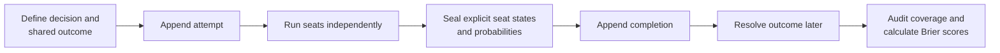

# AI Council

**Measure whether a multi-agent review council is useful—not merely verbose.**

AI Council is an append-only evidence and scoring layer for consequential multi-agent reviews.
Before reviewers answer, the operator records one material, resolvable outcome. Each seat then
prices the same claim independently. The completed set is sealed, the outcome is resolved later,
and the forecasts are scored with the Brier score.

The current release makes forecast collection and grading operational. It does **not** yet prove
that any seat improves decisions, catches novel problems, or deserves to remain on the council.
Those are the next measurements this project is intended to support.

## Why this exists

An AI council can look impressive while every seat repeats the same idea. A consensus can also be
confidently wrong, and a long review can create the feeling of safety without changing the final
decision.

AI Council starts with a narrower question: **did each reviewer make a contemporaneous,
falsifiable judgment that can later be graded?** It preserves the evidence needed to ask harder
questions about correctness, novelty, redundancy, and marginal decision value.

## What works today

- A pre-review `council-attempt` records the question, expected seats, evidence cutoff, decision
  link, and a shared binary outcome before any forecast is visible.
- A completion is accepted only when every expected seat is explicitly `submitted`, `abstained`,
  or `unavailable`.
- Submitted forecasts use stable run, outcome, and prediction IDs and are sealed as one set.
- Resolutions live in an append-only sidecar and support reviewed voids and superseding
  corrections without rewriting history.
- Reports show forecast coverage, overdue grading debt, voids, repeated issuances, unresolved
  outcomes, and descriptive per-seat Brier scores.
- Scores include a constant-50% reference and an explicitly labelled in-sample base-rate bound.
- JSONL parsing and validation fail closed; appends use file locks, flushes, and `fsync`.
- A narrowly scoped repair command can quarantine one confirmed torn final line. It will not skip
  malformed history.
- The repository contains isolated unit tests plus a copied-runtime rehearsal and reversible local
  installer.

The current council adapter has four canonical seats: `code`, `theory`, `ops`, and `blind`.
The scoring core is useful independently, but the installer and runtime contract are intentionally
specific to the deployment that motivated the project.

## Lifecycle



The attempt and completion are stored in the council ledger. Outcome resolutions and temporary
grading-debt overrides are stored separately. Both stores are append-only JSONL.

## Quick start

AI Council requires Python 3.11 or newer and a Unix-like platform (`fcntl` is used for locking).
It has no third-party runtime dependencies.

```sh
git clone https://github.com/garcia42/ai-council.git
cd ai-council
python3 -m venv .venv
. .venv/bin/activate
python -m pip install -e .
```

Run the isolated test suite:

```sh
PYTHONPATH=src:. python -m unittest \
  tests.test_forecasts \
  tests.test_cli \
  tests.test_install \
  tests.test_legacy_report \
  tests.test_rehearse -v
```

Inspect an empty or existing pair of explicit stores:

```sh
python -m council_tools.cli report \
  --log ./council.jsonl \
  --events ./resolutions.jsonl
```

### 1. Record the attempt before calling reviewers

Create an attempt specification:

```json
{
  "question": "Should we deploy the proposed change?",
  "expectedSeats": ["code", "theory", "ops", "blind"],
  "sharedOutcome": {
    "claim": "The change completes its observation window without rollback",
    "resolutionDate": "2027-03-31",
    "resolvedBy": "Inspect the deployment and rollback records",
    "decisionLink": "change-1042",
    "materiality": "A rollback would reject the deployment decision",
    "actionIfTrue": "Retain the change",
    "actionIfFalse": "Revert and investigate",
    "evidenceCutoffAt": "2027-03-01T12:00:00Z"
  }
}
```

Append it and retain the emitted `runId` and `outcomeId`:

```sh
python -m council_tools.cli attempt \
  --log ./council.jsonl \
  --spec ./attempt.json \
  --ts 2027-03-01T12:00:00Z
```

Every reviewer receives the byte-identical shared claim and evidence cutoff. Reviewers must not see
one another's probabilities.

### 2. Seal the completed council

After all calls return, build a completion specification using the emitted `runId`:

```json
{
  "runId": "run-REPLACE_WITH_EMITTED_ID",
  "councilFields": {
    "verdicts": {
      "code": "APPROVE",
      "theory": "CONCERN",
      "ops": "APPROVE"
    },
    "blindSeat": {
      "required": true,
      "ran": true,
      "changedDecision": false
    }
  },
  "seatStates": {
    "code": "submitted",
    "theory": "submitted",
    "ops": "submitted",
    "blind": "submitted"
  },
  "probabilities": {
    "code": 80,
    "theory": 55,
    "ops": 70,
    "blind": 60
  }
}
```

Validate before appending:

```sh
python -m council_tools.cli complete \
  --log ./council.jsonl \
  --spec ./completion.json \
  --check-only

python -m council_tools.cli complete \
  --log ./council.jsonl \
  --spec ./completion.json
```

### 3. Resolve and score

Once the complete resolution date has passed in America/New_York, record durable evidence by the
stable `outcomeId`:

```sh
python -m council_tools.cli resolve outcome-REPLACE_WITH_EMITTED_ID true \
  --log ./council.jsonl \
  --events ./resolutions.jsonl \
  --evidence "deployment record 1042; no rollback during the observation window" \
  --resolver "release-operator" \
  --method deterministic

python -m council_tools.cli report \
  --log ./council.jsonl \
  --events ./resolutions.jsonl
```

For a binary outcome, the Brier score is:

```text
(forecast probability - observed outcome)^2
```

Lower is better: `0` is perfect, `0.25` is the score from always forecasting 50%, and `1` is a
fully confident miss. Early scores remain descriptive because outcomes may be correlated,
seat-controlled, selectively resolved, or too few to support comparisons.

## Safety model

The ledger is evidence, not a cache:

- Existing records are never edited in place.
- Duplicate IDs, malformed JSON, unknown seats, invalid dates, partial completions, and invalid
  corrections are rejected.
- Repeated forecasts remain visible but do not silently replace the earliest forecast for the same
  seat and outcome.
- Three or more outcomes overdue by more than 14 days block decision finalization unless an
  explicit, expiring override is recorded.
- Missing or selectively unresolved outcomes make score status `INCOMPLETE`.
- Runtime logs, prompts, responses, and resolution evidence are private operational data and are
  not included in this repository.

See [the implemented scoring contract](design/2026-08-22-forecast-scoring-mvp.md) for the full set
of invariants and explicit non-goals.

## What comes next

Forecast accuracy is necessary but insufficient. The next phase is designed to measure whether
the council changes decisions for the better:

1. Record immutable references and digests for each seat's exact input and output.
2. Normalize responses into atomic findings with forced operator dispositions.
3. Blindly adjudicate finding correctness, novelty, actionability, and confident errors.
4. Record the decision before and after council review, separating exogenous outcomes from outcomes
   the decision itself controls.
5. Measure finding co-occurrence, error correlation, duplicate coverage, and leave-one-seat-out
   decision effects.
6. Add, replace, or remove seats only after those measurements reveal a coverage gap.

This is deliberately not presented as a seat leaderboard. A low Brier score alone does not show
that a reviewer caught something novel or changed the action usefully.

## Repository map

| Path | Purpose |
| --- | --- |
| `src/council_tools/forecasts.py` | Ledger validation, append operations, resolution rules, audit, and scoring |
| `src/council_tools/cli.py` | Explicit-store command-line interface |
| `runtime/` | Pinned local runtime shim and council contract |
| `install.py` | Checked, backed-up, reversible integration installer |
| `rehearse.py` | Copied-runtime activation rehearsal; does not write live evidence |
| `design/` | Pre-mortem, implementation contract, and design evidence |
| `tests/` | Unit, compatibility, installer, rehearsal, and runtime-contract tests |

## Deployment-specific integration

The checked-in runtime adapter integrates with an existing Claude-based council under
`/home/trader`. It pins the installed shim to a clean source commit and source-tree SHA-256,
backs up all changed targets, rehearses against copied runtime files, keeps a legacy forecasting
store isolated, and restricts live ledger writes to the configured authority host.

That adapter is included as an auditable real deployment, not as a claim of portability. Use
explicit `--log` and `--events` paths for standalone evaluation. Generalizing the seat registry,
runtime paths, and writer authority is future work.

## License

No open-source license has been selected yet. Public availability of the source does not itself
grant reuse rights. Add a license before treating the project as an open-source dependency.
